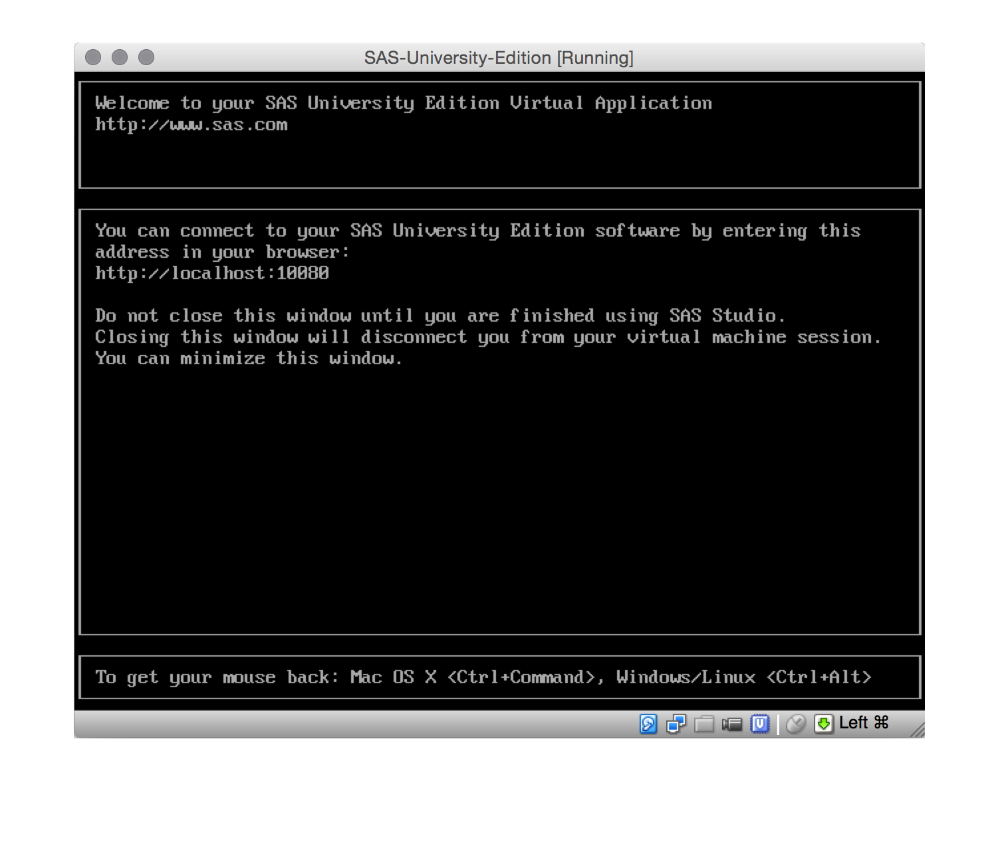
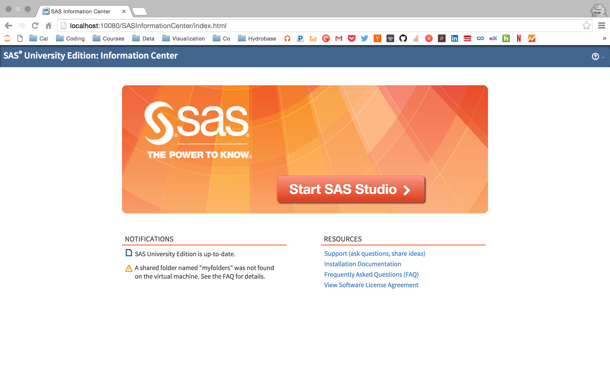

## SAS Studio Installation Instructions

[SAS® University Edition](http://www.sas.com/en_us/software/university-edition.html)

>With SAS University Edition, you get SAS Studio, Base SAS, SAS/STAT, SAS/IML,
 SAS/ACCESS and several time series forecasting procedures from SAS/ETS.

### System Requirements

* One of the following virtualization software packages:
    * Oracle VirtualBox 4.3.16 or later
    * VMware Player 7 (or VMWare Fusion for OS X) or later
* One of the following web browsers:
    * Google Chrome 27 or later
    * Mozilla Firefox 21 or later
    * Apple Safari 6.0 or later
    * Microsoft Internet Explorer 9, 10 or 11

**Windows**

* Microsoft Windows version 7, 8, 8.1 or 10
* 64-bit hardware with a minimum of 1GB of RAM

**MacOS**

* Mac OS X 10.8 or later
* 64-bit hardware with a minimum of 1GB of RAM

**Linux**

* Linux operating environment
* x86-64 hardware with a minimum of 1GB of RAM

### Details

SAS University Edition can be used locally (using virtualization software) or
remotely (using Amazon AWS). This document explains how to install locally
using Oracle's VirtualBox software.

To get started, click
[here](http://www.sas.com/en_us/software/university-edition/download-software.html)
then choose your operating system.

**Set Up**

1. Create a SAS profile
2. Accept the user licensing agreement
3. Download the vApp (+1.7 GB)
4. Install VirtualBox [link](https://www.virtualbox.org/wiki/Downloads)

**Adding the vApp**

1. Launch VirtualBox
2. Import the `.ova` file:
    * File > Import Appliance
3. Select the SAS University Edition vApp (`.ova` file)
4. Then:
    * Open
    * Next
    * Import

**Starting the vApp**

1. Select (highlight) "SAS-University-Edition"
2. Start the application:
    * Machine > Start, or
    * Click the Start button (green right arrow)

A window will appear indicating that the SAS virtual application is starting.

You will see something like:

**Starting SAS Studio**

In your browser, on your local machine, navigate to the specified address.
E.g., `http://localhost:10080`.

You should be taken to a page like the following:

That's SAS Studio!

