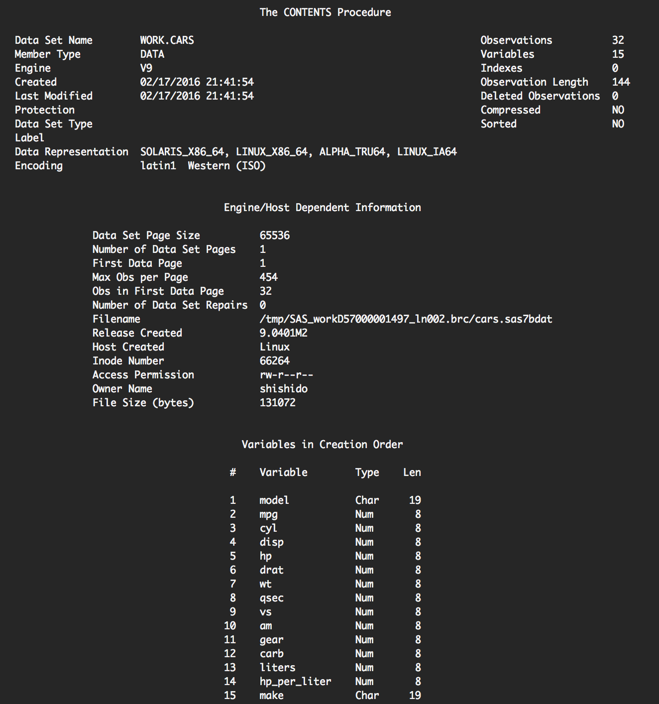
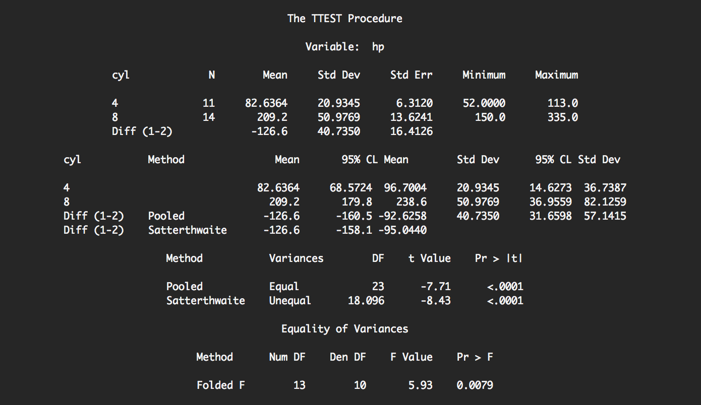

% Introduction to SAS
% Juan Shishido, D-Lab, UC Berkeley
% Month Day, 2016

# Introduction

## What is SAS

>SAS is an integrated system of software solutions.

It enables:

- data management
- report generation
- plotting
- statistical and mathematical analyses
- and more

## Products

- Base SAS
- SAS/STAT
- SAS/ETS
- SAS Text Miner
- SAS Energy Forecasting
- and much, much more

[Products & Solutions A-Z](http://www.sas.com/en_us/software/all-products.html)

## Base SAS

Includes:

- a programming language
- a data management facility
- data analysis and reporting utilities

Base SAS is at the core of the SAS System

# Programming Language

## Programming Language

>The SAS language contains statements, expressions, functions and CALL
routines, options, formats, and informats.

There are two main components:

* data steps
* procedure steps

SAS programs&mdash;files ending in the `.sas` file extension&mdash;typically
include several DATA and PROC steps

## Programming Language

Example of a DATA step

```
data example;
    infile 'path/to/file';
    input x1 x2 x3;
run;
```

## Programming Language

### Syntax

One of the most important rules is that **SAS statements must end with a
semicolon**

SAS statements can span multiple lines

Multiple SAS statements can appear on the same line, so long as each is
separated by a semicolon

A `run;` statement, which creates a "step boundary," marking the end of a step,
isn't required between steps in a program, but is recommended

## Programming Language

### SAS Names

Are used for data sets, variables, and other items

In general, these names must:

- contain only letters, numbers, or underscores (`_`)
- begin with a letter or underscore
- have a length betwen one and 32 characters
    - maximum length varies by name type (e.g., variable names versus library
      references)
- not contain blanks

Names are *not* case sensitive

# Data Management

## Data Representation

In SAS, data is organized into rows and columns in what is called a SAS data
set

x1   |  x2  | x3
:--: | :--: | --
25   |  m   | berkeley
26   |  f   | san francisco
23   |  f   | oakland
24   |  m   | marin

Each row is sometimes called an "observation" and each column a "variable"

## DATA Step

DATA steps begin with the `data` statement and are typically used to create,
modify, or replace SAS data sets

Data can either be read inline or from external sources, such as `.txt`,
`.csv`, or `.sas7bdat` files

SAS data sets can either be temporary or permanent

Temporary data sets are stored in the `WORK` library and are deleted at the end
of each SAS session

Permanent data sets are saved to disk

## DATA Step

SAS data sets are temporary, by default

In the code above, `example` is a temporary SAS data set

To read or write a *permanent* SAS data set, use dot notation such as
`libref.dataset`

The `libref` is a name associated with a SAS library or directory location

It is possible to use `work.dataset` to be explicit about temporary data sets

## DATA Step

To set up a `libref` use the `libname` keyword

```
libname mylib 'path/to/dir';
```

In this example, `mylib` is a variable representing the `path/to/dir` location

Note that `libref` names can only be 8 character long and should appear before
any references are made to it in your program

## DATA Step

```
data mylib.example;
    ...
run;
```

In the code above, the data set `example` will be saved to the location
associated with `mylib`

## DATA Step

There are several ways to read data into a SAS data set

* `datalines`: for inline data
* `infile`: for data from an external file
* `set`: for a SAS data set

It's important to note that both the `datalines` and `infile` approaches
require the use of an `input` statement, which

>Describes the arrangement of values in the input data record and assigns input 
values to the corresponding SAS variables.

# Data Analysis

## PROC Step

SAS procedures are built-in programs that use SAS data set values to produce
specific output

These are called using PROC Steps, which begin with the `proc` keyword

There are three main types of SAS procedures:

* report writing
* statistics
* utilities

## PROC Step

>[Report writing] procedures display useful information, such as data listings
(detail reports), summary reports, calendars, letters, labels, multipanel
reports, and graphical reports.

## PROC Step

>[Statistics] procedures compute elementary statistical measures that include
descriptive statistics based on moments, quantiles, confidence intervals,
frequency counts, crosstabulations, correlations, and distribution tests. They
also rank and standardize data.

## PROC Step

>[Utility] procedures perform basic utility operations. They create, edit,
sort, and transpose data sets, create and restore transport data sets, create
user-defined formats, and provide basic file maintenance such as to copy,
append, and compare data sets.

## PROC Step

One of the most basic procedures is PROC PRINT

```
proc print data=example;
run;
```

This prints the SAS data set `example`

## PROC Step

PROC Steps often have several optional arguments

With PROC PRINT, for example, we can specify the number of observations (rows)
as well as the variables (columns) we want printed

```
proc print data=example (obs=10);
    var x1 x2;
run;
```

# Running SAS Code

## Ways to Run SAS Programs

There are several ways to execute or run SAS programs

>They differ in the speed with which they run, the amount of computer resources 
that are required, and the amount of interaction that you have with the program 
(that is, the kinds of changes you can make while the program is running).

The results and output&mdash;that is, the data sets and values&mdash;are the
same regardless of the way the program is executed (although the *appearance*
might be different)

## Ways to Run SAS Programs

### Windowing Environment

The SAS windowing environment is a stand-alone desktop application

It includes, among other things, an editor for writing code and an output
window

Entire programs or individual code blocks can be submitted

Log information and output is typically printed to their corresponding windows
instead of being saved to external files

## Ways to Run SAS Programs

### SAS Studio

>SAS Studio is a developmental web application for SAS that you access through
your web browser.

This is a web browser-based environment

>With SAS Studio, you can access your data files, libraries, and existing
programs and write new programs.

In subsequent workshops, we'll use SAS Studio

## Ways to Run SAS Programs

### SAS Studio


## Ways to Run SAS Programs

### Noninteractive mode

With this approach, entire SAS programs are submitted

This is the only way to interact with SAS if all you have access to is a
command line interface

To run a SAS program from the command line

```
$ sas filename.sas
```

The log information is saved to `filename.log` and the output, if any, to
`filename.lst`

## Getting Help

An important programming skill is knowing *how* to find help

SAS provides extensive documentation
([link](https://support.sas.com/documentation/)) with information on syntax,
options, and examples

UCLA's Institute for Digital Research and Education
([link](http://www.ats.ucla.edu/stat/sas/)) is another great resource

## Getting Help

Often times, I rely on Google searches like: "sas average by group"

I sometimes search for specific information about a PROC

Your searches might return papers from SUGI (SAS Users Group International) or
NESUG (Northeast SAS Users Group)&mdash;these are often quite good

# Coding

## `auto`

To this point, we've described, at a high level, the two primary components of
the SAS language

For the remainder of the workshop, we'll show and describe SAS code in order to
get familiar with the details and work through common problems

We'll start by creating a SAS data set using inline data

Then, we'll print some summary statistics

(The code for this can be found in `code/firstprogram.sas`)

## `auto`

```
data auto;
  input make $ price mpg rep78 foreign;
datalines;
AMC    4099 22 3 0
    ...
Datsun 8129 21 4 1
;
run;
```

In this example, we're creating a SAS data set that we're naming `auto`

We use `datalines` to let SAS know the data will provided inline

## `auto`

```
data auto;
  input make $ price mpg rep78 foreign;
datalines;
AMC    4099 22 3 0
    ...
Datsun 8129 21 4 1
;
run;
```

Notice that semicolons (`;`) are *not* used at the end of each data line, only
at the end of the block

## `auto`

```
data auto;
  input make $ price mpg rep78 foreign;
datalines;
AMC    4099 22 3 0
    ...
Datsun 8129 21 4 1
;
run;
```

The the `input` statement is used to specify the variable names&mdash;in this
case, there are five columns, so we list five variable names

## `auto`

```
data auto;
  input make $ price mpg rep78 foreign;
datalines;
AMC    4099 22 3 0
    ...
Datsun 8129 21 4 1
;
run;
```

You may have noticed a `$` after the `make` variable name

This lets SAS know that `make` is a character variable

## Average MPG

Let's say we're interested in calculating the average mpg for foreign and
domestic cars in our data set

We can do this using the means procedure (`proc means`)

```
proc means data=auto;
    class foreign;
    var mpg;
run;
```

## Average MPG

```
proc means data=auto;
    class foreign;
    var mpg;
run;
```

Here, we specify the input data (`data=auto`), the variable we want the means
for (`var mpg`), and the "by" group (`class foreign`)

## A Note on Output

If we wanted to run this code in batch mode, we would do the following

```
$ sas firstprogram.sas
```

If things go well, you won't see any output when you submit this program

So, where does the output go?

Whenever programs (or individual SAS code blocks) are run, SAS always produces
a log file (with file extension `.log`)

## A Note on Output

This gives information about the steps that were executed, how long they took,
and messages related to any particular errors

In addition, if there are things that are printed (a lot of `PROC`s produce
this type of output), a listing file will be created (with file extension
`.lst`)

## Comments

SAS provides two ways to add comments

```
*message;
```

```
/*message*/
```

SAS ignores comments during processing

## Loading

Typically, `datalines` won't be used in practice

Instead, we load data from external sources

These can be comma-separated value files, for example, or SAS data sets

When loading data, we must use either `infile` or `set` statements, depending
on the data source

## Loading

In `data/` there is a small CSV file named `mtcars.csv`

To load this data into SAS, use the following (a `.sas` file can also be found
in `code/`)

```
data cars;
    infile '../data/mtcars.csv' dlm=',' dsd firstobs=2;
    input model : $19. mpg cyl disp hp
          drat wt qsec vs am gear carb;
run;
```

This `infile` statement includes several options we have not seen before

## Loading

Perhaps the most important is the `dlm` option, which specifies the delimiter
that separates the variables in the file

If data contains missing values, as `mtcars.csv` does, the `dsd` options allows
SAS to recognize two consecutive delimiters as such

`dsd` also allows the data to include the delimiter within quoted strings

Finally, the `firstobs` option allows us to specify the line at which SAS
should start reading data from

Because `mtcars.csv` includes a "header" with variable names, we start at line
2

## Loading

We have previously seen that `$` lets SAS know the associated column should be
read in as character

By default, SAS only reads the first 8 characters, but we can specify a length

The drawback is that we have to know the maximum length, which is 19 in this
case

The colon modifier (`:`) is also important here as it tells SAS to read the
record until there it encounters the delimiter

The `.` in `$19.` is also necessary

## Loading

```
proc import datafile='../data/mtcars.csv'
    out=cars_imported
    replace;
    getnames=yes;
run;
```

Alternatively, we can use SAS's import procedure to load the data

With `proc import`, we specify the input data using `datafile`

Because SAS recognizes that `.csv` files are comma-separated, we don't have to
be explicit about the delimiter

`proc import` requires that we provide an output data set using `out`

## Loading

```
proc import datafile='../data/mtcars.csv'
    out=cars_imported
    replace;
    getnames=yes;
run;
```

The `replace` option is used to overwrite an existing SAS data set

Use the `getnames` option to specify whether variable names should be generated
from the first record in the input file

Because the first record for our input file has a missing value in the first
position, SAS uses the default `VAR1` name for that column

## Loading

This is what the `cars` data set looks like (from the .lst` file)


## Contents

`proc contents` describes a SAS data set

```
proc contents data=cars varnum;
run;
```

This outputs information at both the data set and variable levels

For example, it returns the number of observations, the number of variables,
the variable names and formats, and much more

The `varnum` option lists the variables in "creation order"

## Contents

`proc contents` output



## Creating Variables

Next, let's say we're interested in converting our displacement variable
(`disp`) from cubic inches to liters, using the conversion rate found
[here](http://www.metric-conversions.org/volume/cubic-inches-to-liters.htm)

In SAS, we can simply add the following to our existing DATA step: `liters =
disp / 61.024;`

We might also be interested the vehicles' power density values

## Creating Variables

```
data cars;
    infile '../data/mtcars.csv' dlm=',' dsd firstobs=2;
    input model : $19. mpg cyl disp hp
          drat wt qsec vs am gear carb;
    liters = disp / 61.024;
    hp_per_liter = hp / liters;
run;
```

Because we're curious about which cars are the most power dense, we should sort
our existing SAS data set by `hp_per_liter`, in descending order

## Sorting

```
proc sort data=cars out=power_density
        (keep=model hp liters hp_per_liter);
    by descending hp_per_liter;
run;
```

The `out` option tells SAS that the procedure should create a new data set
called `power_density`

To this, we add a `keep` option, only keeping the `model`, `hp`, `liters`, and
`hp_per_liter` variables; without this option, all variables would be written
to `power_density`

## Sorting

```
proc sort data=cars out=power_density
        (keep=model hp liters hp_per_liter);
    by descending hp_per_liter;
run;
```

The `by` statement tells the procedure what variable(s) we'd like to sort by

By default, sorting occurs in ascending order

To sort in descending order, add the `descending` keyword *before* the variable
name

## Sorting

The Ferrari and Lotus models are the most power dense


## String Manipulation

It might be useful to extract the make from the `model` variable

To do this, we can use the `scan()` function to our existing DATA step

```
make = scan(model, 1, ' ');
```

`scan()` takes a string as its first argument&mdash;in this case,
`model`&mdash;a position, and a delimiter

The string is split on the delimiter&mdash;a single space

It then returns the first word

## Sums

In some cases, it might be useful to summarize our data by taking column sums

We might be interested in knowing the total horsepower for the vehicles in our
data set, for example

There are several ways to do this

## Sums

One way is to use `proc print`

```
proc print data=cars;
    var hp;
    sum hp;
run;
```

This prints all of the `hp` observations in `cars`, but adds a total at the
bottom of the output

In some cases, this isn't desirable

We might, instead, want to only output the total

## Sums

>`proc summary` is one of the most powerful procedures to summarize numeric
variables and place aggregated results into a new SAS data set.

## Sums

```
proc summary data=cars;
    var hp;
    output out=cars_summ (drop=_TYPE_)
        sum=hp_total mean=hp_mean;
run;
```

`proc summary` requires that we specify an output data set using `output out`

This procedure is flexible, allowing us to calculate sums, means, and much more

## Sums

```
proc summary data=cars;
    var hp;
    output out=cars_summ (drop=_TYPE_)
        sum=hp_total mean=hp_mean;
run;
```

The `drop` option next to the new data set name, `cars_summ`, tells SAS to not
include the listed variables

For the specified operations&mdash;that is, `sum` and `mean`&mdash;we list
corresponding variable names

## Sums

>`proc sql` can sort, summarize, subset, join (merge), and concatenate
datasets, create new variables, and print the results or create a new table or
view all in one step.

## Sums

```
proc sql;
    create table cars_sql as
    select count(*) as _FREQ_,
           sum(hp) as hp_total,
           mean(hp) as hp_mean
    from cars;
quit;
```

Note that `proc sql` steps end with `quit;` rather than `run;`

Using SQL syntax, we can recreate the results from the `proc summary` step

## Sums

```
        Obs    _FREQ_    hp_total    hp_mean

         1       32        4694      146.688
```

## Loops

Loops&mdash;referred to as `do` loops in SAS&mdash;enable iteration

>[They execute] statements between the `do` and `end` statements repetitively,
based on the value of an index variable.

## Loops

```
data squares;
    do x = 2 to 10 by 2;
        x_squared = x ** 2;
        output;
    end;
run;
```

This DATA step loops over the values 2 and 10 and outputs five
records&mdash;the values 2, 4, ..., 10 as well as their squares

The `output` statement "writes the current observation to data set"

## Loops

```
data squares;
    do x = 2 to 10 by 2;
        x_squared = x ** 2;
        output;
    end;
run;
```
The default increment in a `do` loop is 1

However, we can use the `by` keyword to increment by any positive or negative
number

## Loops

The resulting data set looks like this

```
            Obs     x    x_squared

             1      2         4   
             2      4        16   
             3      6        36   
             4      8        64   
             5     10       100
```

## IF-THEN/ELSE

SAS supports control flow with the `if` and `else` statements

```
if expression then statement;
<else statement>;
```

If the condition(s) in the `if` clause are met, the statement is executed

Otherwise, the next line is evaluated

The optional `else` statement, which must immediately follow the IF-THEN
statement, is executed if the `then` clause before it isn't

## IF-THEN/ELSE

Using our `cars` data set, let's conditionally output observations

```
data toyota mazda;
    set cars;
    if make = 'Toyota' then output toyota;
    else if make = 'Mazda' then output mazda;
run;
```

Here, we use `set` because `cars` is an existing SAS data set

## Exporting

We've already seen how to create permanent SAS data sets

Sometimes, we want to export data sets in other formats

```
proc export data=power_density
    outfile='../data/power_density.csv'
    replace;
run;
```

This creates a `.csv` file in `data/` based on our `power_density` data set

## Analysis

Let's say we wanted to get a count of the number of vehicles in each cylinder
class

That is, the number of 4-, 6-, and 8-cylinder cars in our data set

For this, we could use the frequency procedure

```
proc freq data=cars;
    table cyl;
run;
```

## Analysis

This produces the following output

```
                 The FREQ Procedure

                              Cumulative    Cumulative
cyl   Frequency    Percent     Frequency      Percent
------------------------------------------------------
  4         11      34.38            11        34.38  
  6          7      21.88            18        56.25 
  8         14      43.75            32       100.00 
```

## Analysis

There are a relatively similar number of 4- and 8-cylinder cars in our data set

A question we might want to answer is whether the horsepower differs between
these groups

For this, we can use SAS's t-test procedure

## Analysis

We first create a data set with only the 4- and 8-cylinder vehicles and then
sort the data

For the two-sample t-test

```
proc ttest data=cars_4_8;
    class cyl;
    var hp;
run;
```

## Analysis

The output for the t-test procedure

$p$-value < 0.0001



# References

## Links

- [An Introduction to the SAS System](http://www.stat.berkeley.edu/~spector/s100/sas.pdf)
- [Reading Data into SAS](http://www.ats.ucla.edu/stat/sas/library/SASRead_os.htm)
- [SAS DATA Steps](https://www.ssc.wisc.edu/sscc/pubs/4-18.htm)
- [Base SAS 9.2 Procedures Guide](https://support.sas.com/documentation/cdl/en/proc/61895/PDF/default/proc.pdf)
- [`infile`](http://www.ats.ucla.edu/stat/sas/faq/InfileOptions_ut.htm)
- [`sum` function](http://www.lexjansen.com/nesug/nesug12/cc/cc35.pdf)
- [`proc sql`](http://www2.sas.com/proceedings/sugi27/p191-27.pdf)
- [IF-THEN/ELSE](http://support.sas.com/documentation/cdl/en/lrdict/64316/HTML/default/viewer.htm#a000202239.htm)
- [Loops in SAS](http://blogs.sas.com/content/iml/2011/09/07/loops-in-sas.html)
- [`do` loops](http://support.sas.com/documentation/cdl/en/lestmtsref/63323/HTML/default/viewer.htm#p1cydk5fq0u4bfn1xfbjt7w1c7lu.htm)
- [Conditionally Writing Observations](http://support.sas.com/documentation/cdl/en/basess/58133/HTML/default/viewer.htm#a001343763.htm)
- [`proc import`](http://support.sas.com/documentation/cdl/en/proc/61895/HTML/default/viewer.htm#a000308090.htm)
